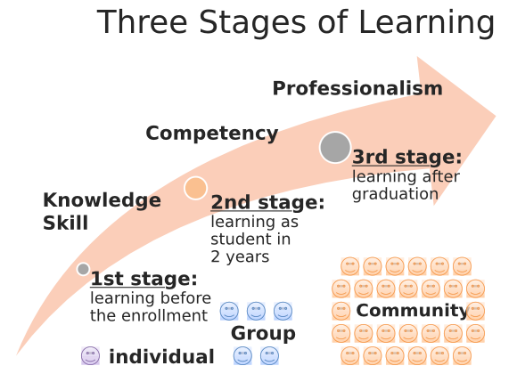
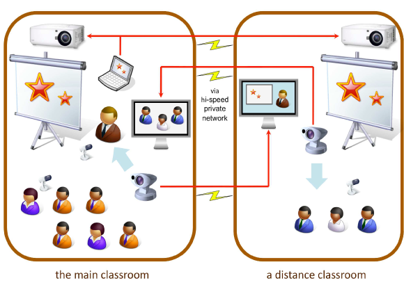
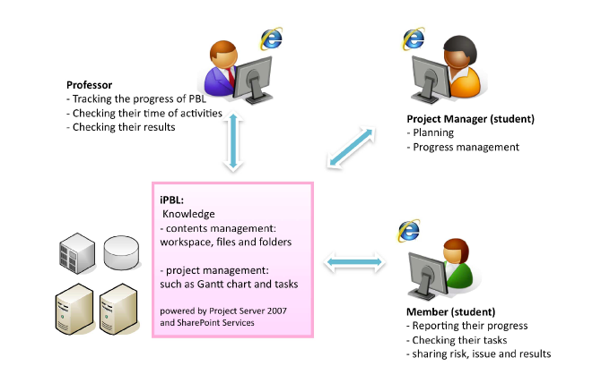

産業技術大学院大学のICT環境の運用と課題
=======================================

産業技術大学院大学

中鉢 欣秀・小山 裕司・石島 辰太郎
	
産業技術大学院大学
------------------

- 産業技術大学院大学

  Advanced Institute of Industrial Technology

- 2つの専攻

  - 2006年 情報アーキテクチャ専攻 設置
  - 2008年 創造技術専攻 設置

- 東京都が設置した専門職大学院（公立）

  高度専門職を養成するとともに，常に新鮮な知識を提供することで継続的な教育をする

3段階の教育機会
---------------

通常の大学院との違い
--------------------

社会人学生が多い

- 業務経験を有するものが多い
- 高い職業意識

年齢層が幅広い

- 20歳台後半から60歳台まで（30歳台が多い）

社会人の割合と年齢
------------------

専攻全体（2011年度）

- 約60%が社会人，平均年齢は 33.2歳

情報アーキテクチャ専攻

- 約90%が社会人，平均年齢は36.2歳

社会人のための学修環境
----------------------
単位バンク制度

- 入学前に科目等履修生として履修した分の授業料が入学後に返還される制度

履修証明プログラム

- 短期間で専門分野の学修ができる

遠隔授業

- 一部の授業は秋葉原サテライトキャンパスでも受講可能

.. 各種勉強会
..
..   - InfoTalk、デザインミニ塾など

科目等履修生（単位バンク制度）
------------------------------

通常の学生の定員

- 1，2年次を合計して200名

科目等履修生の人数

- 平成21年度 68名、平成22年度 72名
  平成23年度 51名

単位バンク制度の利用者数

- 平成22年度 20名、平成23年度 21名
- 平均約3.5科目（最高10科目）を事前に履修してから本学に入学

PBL(Project Based Learning)
---------------------------

PBL（Project Based Learning）

- 実践的な業務遂行能力を育成できる

PBLの実施

- 修士課程の2年生を対象とし、期間は1年間
- グループワークを主体としたチーム活動

本学における課題
----------------

- 社会人を中心とした学生のニーズに耐えられる教育の提供

- 物理的・時間的に距離のある対象者に対しても教育を行うための仕組み

- 情報システムを活用した教育用のインフラストラクチャーの整備

通常の講義を支援するシステム
----------------------------

本学では2年間の通学により修士号を取得できる

- 通信制大学ではない

授業では教員・学生間あるいは学生相互の議論・意見交換を重視する

- グループワークを多く取り入れており，学生間のコネクション構築に繋がっている

しかし，社会人学生は大学での学修のため潤沢に時間を使うことが難しい

- オンラインを活用する

授業動画コンテンツ配信システム
------------------------------

欠席した授業の動画を見ることができる

- 出席した授業の復習にも利用できる

修了生も閲覧可能

- 卒業後10年間，無料で本システムにアクセスすることができる

サテライトキャンパス
--------------------

学生による授業評価システム
--------------------------

- FD活動の一環として，学生による授業評価を実施できるシステム
- 従来発生していた人手による評価結果の集計作業をなくすことができた

PBLを支援するシステム
---------------------

iPBLの機能-1
------------

プロジェクトマネジメント

- WBS（Work Breakdown Structure）によりプロジェクトの進捗管理を行うこ とができるシステム

プロジェクトワークスペース

- プロジェクトの成果物（ファイル）を共有するためのワークスペース

iPBLの機能-2
------------

週報システム

- 毎週の活動状況を教員に報告するためのフォームを自動で生成する．

セルフアセスメントシステム

- 各期末に，自身の学修を振り返るための評価シートを生成する．

成績評価システム

- プロジェクトを担当する全教員が学生の成績を入力するシステム

PBLのためのその他のシステム
---------------------------

プロジェクト配属システム
    
- 学生が履修したいプロジェクトを選択するシステム

- 学生は，どのプロジェクトにどのようなメンバーが居るのかを確認しながら，プロジェクトを選ぶことができる．

情報システム全般に関する
------------------------

多様な制度に対応する情報システムの運用

- 例）科目等履修生として在籍した学生が修士課程に入学した場合、新たなアカウントへのデータ移行が必要、など

情報システムのユーザが多様であること

- 情報技術に関して高度な要求をする学生から、ITリテラシーに乏しい学生まで

今後導入するシステム
--------------------

学生のカルテ・ポートフォリオ

- 多様な学生の学習状況を把握できるカルテシステム
- 対外的な成果物のアピールを支援するポートフォリオシステム

入学前，修了後における大学と社会人とのコネクション維持

- FacebookやTwitterといったソーシャルメディアの積極的な活用

PBL用インフラストラクチャの改善
-------------------------------

iPBLのリプレース

- MS SharePointをベースとした現状のシステムには不満が多い

ソフトウェア開発プロジェクトに対応するより高度な機能

- プロジェクトに向けたソースコードのバージョン管理システム（VCM）
- WBSにかわる、バーンダウンチャートをもちいたアジャイル開発への対応

おわりに
--------

- 本稿では，産業技術大学院大学における継続的な専門職教育の取り組みと，それを支えるシステムの課題を考察した

- 今までの運用経験を活かしながら、これらの改善作業に取り組み，そこで得られた知見を積極的に公開したい

ご清聴ありがとうございました
----------------------------

- 中鉢 欣秀
  yc@aiit.ac.jp
